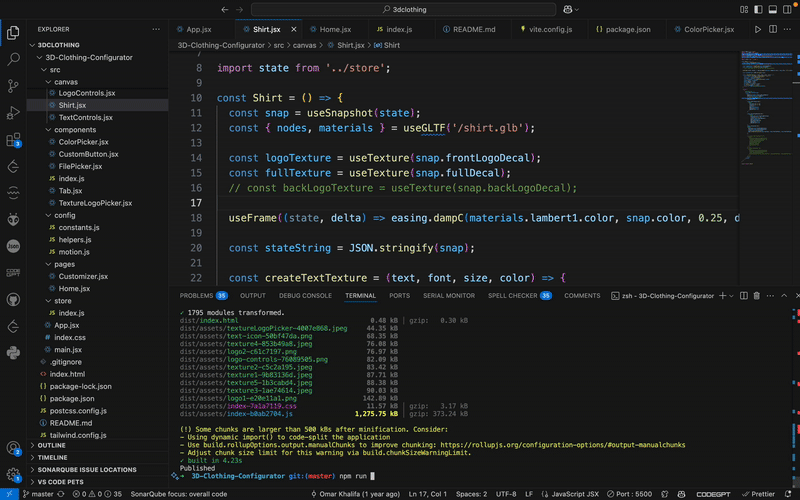
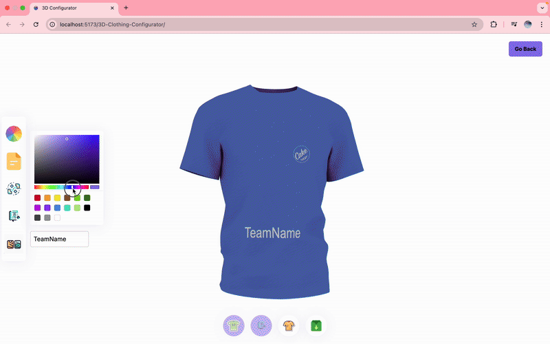
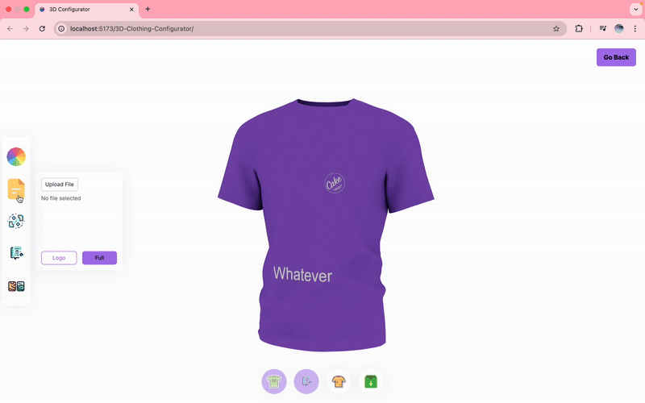
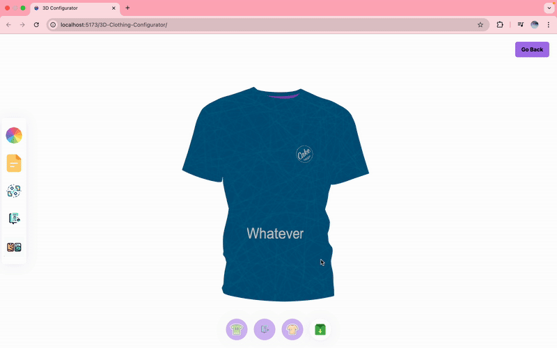

# Cake Team Kit Customizer 🚴‍♀️

A playful cycling jersey configurator built with Vite, React, and react-three/fiber. This interactive tool allows users to design their own **Cake team jersey** in real-time — choosing colors, adding logos, and customizing the team name on the fly.

## ✨ Features

- 🎨 **Live Color Picker** — instantly see how your jersey looks in different colorways.
- 🧢 **Front Logo Placement** — includes a Cake logo positioned on the chest.
- ✍️ **Team Name Input** — type your team name and see it instantly appear on the jersey.
- ⚡ **Responsive 3D Preview** — spin, zoom, and inspect the jersey in 3D using `react-three/fiber`.
- 🚫 Simplified Interface — back logos and text have been removed to focus on the front.
- 🌐 Built for easy future integration (lead generation or inquiry forms).

## 🧪 Prototype Purpose

This prototype demonstrates a potential user journey for Cake’s **bespoke team kit ordering process**. It offers a low-barrier, fun interaction to increase engagement and reduce hesitation before contacting the team.

## 🎥 Demo Preview

Here’s a quick look at the prototype in action:






## 🚀 Getting Started

```bash
# 1. Clone the repository
git clone https://github.com/AdeDeepFishing/3D-Clothing-Configurator.git

# 2. Install dependencies
npm install

# 3. Run the dev server
npm run dev
